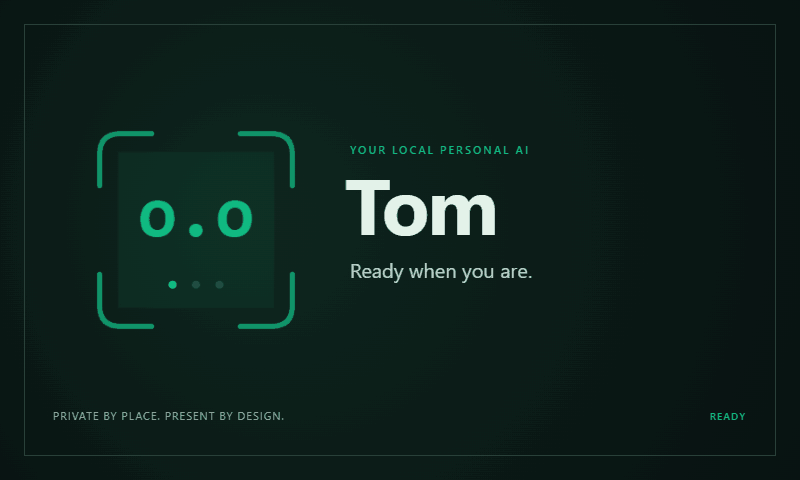
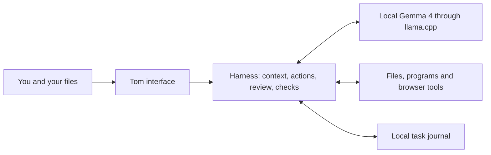
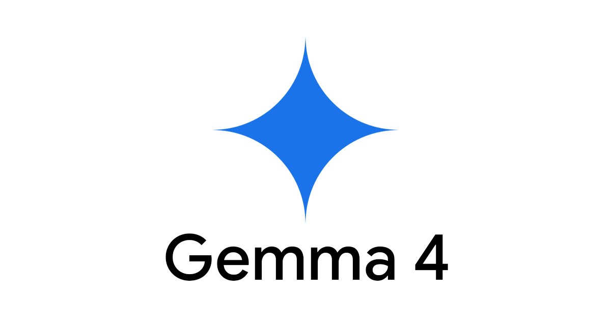

# Tom
### A local Windows AI with its work in view.

**[Get Tom](https://github.com/OsbornVentures/Tom/releases/tag/v0.5.2-beta) · [User guide](docs/USER-GUIDE.md) · [Measured results](docs/benchmarks/0.5.2.md) · [Build it](docs/BUILD.md)**

Tom brings a small Gemma 4 model, a visible action harness and a friendly interface to your Windows computer. Ask about a file, make a checklist, transform a small table, draft a local webpage, or attach an image. Follow the work, review commands, inspect the result and open saved files right where they live.

**0.5.2 is an unsigned beta.** Focused local tasks are the sweet spot. Browsing is limited; long tasks, complex code and self-written tests can go wrong. We publish failures alongside successes.

## Pick your package

| Edition | What you get | Best fit |
|---|---|---|
| **[Network setup](https://github.com/OsbornVentures/Tom/releases/download/v0.5.2-beta/Tom-0.5.2-Network-Setup.exe)** | Small installer; fetches pinned model and runtime files from their original vendors | First install with internet |
| **[Offline setup](https://github.com/OsbornVentures/Tom/releases/tag/v0.5.2-beta)** | Complete app, E2B model, vision projector and CPU/Vulkan engines | USB and offline installation after system prerequisites |
| **Source** | Readable app/harness code, tests, licenses, build instructions and evidence | Inspect, modify or build Tom |

The full offline EXE exceeds GitHub’s 2 GiB asset limit. Download its two parts and reconstruction helper from the release; hashes verify the parts and finished EXE. The Tom USB carries the complete EXE. Installers are release assets, separate from the source repository.

**Requires:** Windows 10/11, Intel/AMD x64, a supported installed browser, .NET Framework and [Microsoft’s latest Visual C++ x64 runtime](https://learn.microsoft.com/en-us/cpp/windows/latest-supported-vc-redist). Install prerequisites before going offline. No GPU is required. 8 GB RAM is the compatibility target; 16 GB offers more headroom. Physical 8 GB qualification is pending; development measurements use a 32 GB host. ARM, macOS and Linux packages are not provided.

## Make the work understandable

| Feature | What it does |
|---|---|
| **A face for the activity** | Nine harness states, three-character faces, intentional blinks, scanlines and waiting dots. Amber needs attention; red means a stopped error. |
| **An honest startup screen** | Chat waits while Tom shows its actual checks and loads the selected model. Avatar and Help stay available. |
| **Context you can see** | A small ring shows measured usage; its center counts compactions. Three lines merge when context is shortened. Help explains what can be lost. |
| **Actions within reach** | Avatar → Tom → context → expandable actions, in one compact reply header. |
| **Files that stay local** | Real paths with Open locally, Show in folder and Copy path. |
| **Your preferred name** | Setup asks what Tom should call you, prefilled from Windows. Change it in Settings. |
| **Help built in** | 21 searchable offline FAQs explain AI, attention, harnesses, context, privacy, capabilities and limits. |
| **Manual update checks** | Settings checks published GitHub versions and opens the release page. You choose when to install. |

## What can you ask?

- “Read these notes and save a short plan in this folder.”
- “Filter this JSON to enabled items and total the amounts by category.”
- “Make a small offline HTML checklist, then check it in the browser.”
- “Explain what you can see in this screenshot.”
- “Help repair this small function and show me the checks.”

Tom can read and write text files, make exact edits, run reviewed programs, inspect supported browser pages and recall its task history. Generated JSON, JavaScript and HTML get relevant basic checks. Those checks catch some errors; they do not prove a whole result is correct. Images can lose exact text and fine detail.

**Browsing needs patience and skepticism.** Search can fail, dynamic or protected pages can be unreadable, and plausible answers can have weak evidence. Supply a direct page or paste the source when possible. Tom is not a dependable general web agent.

## Local model, visible harness

The model proposes language and actions. The harness supplies context, routes tools, records evidence, tracks budgets and decides whether a step needs review. Its expressions describe activity; they are not model emotions. [How the harness works](docs/HARNESS.md).

<strong>How private is local?</strong>

The model runs on your computer. Conversations, images, preferences and task records live in Tom’s local `.state` folder. Search queries and browsed pages use external services; downloads and manual update checks also use the internet. Local does not mean every feature is offline.

Commands run with your Windows account’s access. The work folder is a starting location, not a security sandbox. Review unfamiliar actions and keep backups. Public README badges read GitHub’s public counters; no secret-powered statistics worker is required. Download counts count release assets, not unique users or installations.

<strong>Does compaction make Tom forget?</strong>

A model sees a limited working window. The harness shortens older context to make room while retaining the full task record locally. Details can drop out of the current prompt; repeated compaction can reduce accuracy. The count is a reason to check important details, not a mathematical accuracy score. Ask Tom to reread source files and restate critical constraints.

The FAQ introduces [Attention Is All You Need](https://arxiv.org/abs/1706.03762) in plain language: attention helps a model weigh which pieces of input matter to each other. It does not guarantee truth, understanding or reliable memory.

## Evidence over promises

Fresh 0.5.2 checks: **5/6 local tasks completed correctly; 2/5 broader tasks passed**, with one dependent follow-up not run. Pagination produced correct code but stalled. Browsing and the webpage task failed; the simple image check passed.

Read the [0.5.2 release measurements](docs/benchmarks/0.5.2.md) for outcomes, timings, configuration and limitations. These are small, developer-visible checks on one physical computer, not a held-out leaderboard or a general customer success rate.

The earlier [64-trial E2B Q4 comparison](docs/benchmarks/e2b-capability-2026-09-06/REPORT.md) found substantial harness weaknesses: earlier Tom passed 6/16 artifact checks, compared with Aider’s 14/16 on the same eight tasks and two seeds. That historical result remains published. Later repairs and this release’s trials use different conditions and do not erase it. File handling and small data tasks are a useful focus; complex repairs, long browser work and verification remain uneven.

## Update without starting over

Choose **Settings → Check for updates**, quit Tom, then run the new installer into your existing Tom folder. Conversations, preferred name, preferences and optional models are retained; ordinary replacement failures roll back. Do not uninstall first. Back up important work: power-loss recovery during updates is not qualified. [Release notes](docs/RELEASE-0.5.2.md).

## Built on good work

| Component | Credit and license |
|---|---|
| Tom interface and harness | OsbornVentures · **Apache 2.0** |
| Gemma 4 E2B QAT Q4_0 and matching vision projector | Google DeepMind · **Apache 2.0** |
| llama.cpp b10809, CPU and Vulkan backends | ggml-org and contributors · **MIT** |
| Node.js 24.19.0 | Node.js contributors · **MIT and included dependency notices** |
| SQLite | SQLite authors · **public domain** |
| Playwright Core 1.62.1 | Microsoft · **Apache 2.0**; uses a separate installed browser |
| LLVM OpenMP | LLVM contributors · **Apache 2.0 with LLVM exceptions** |
| Windows, .NET Framework, Visual C++ and browser | Separate system prerequisites · **their vendors’ terms** |
| Exa search | External service · **service terms**; queries leave the computer |
| Development assistance | Built with **GPT-6 Astra** in Codex; Tom’s runtime model is Gemma |

[Third-party notices](THIRD_PARTY_NOTICES.md) · [Tom license](LICENSE) · [Attribution](NOTICE). Gemma 4’s Apache license differs from older Gemma terms. llama.cpp is an inference engine, not Meta’s Llama model. Names and supplied identification artwork retain their owners’ rights; no third-party endorsement is claimed.

## Help shape Tom

[Report a reproducible issue](https://github.com/OsbornVentures/Tom/issues) with the version, relevant hardware, steps and expected result. Remove private paths, chats and connection credentials before sharing logs. See [contributing](CONTRIBUTING.md).

Next priorities: clean-machine and low-memory testing, stronger action isolation, better browsing evidence, and clearer recovery from interrupted work.
